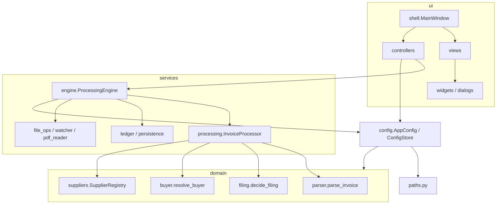
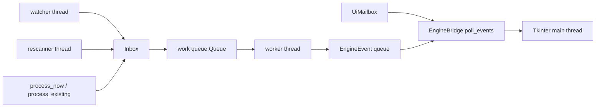

# Architecture

Automator is a desktop filer for AFIP invoice PDFs. It watches a downloads folder, reads each file, detects voucher type, number, supplier and buying company (by CUIT), and files the renamed PDF under `base/{empresa}/{proveedor}`. Buying companies live in `config.json`. Issuers live in an Excel-imported SQLite supplier registry that canonicalizes the folder name by matching invoice text against known CUITs and aliases. The Windows build is a packaged `.exe`.

**No invoice is ever misfiled or lost silently.** On any uncertainty (supplier undetected, ambiguous buyer, unreadable PDF) the file goes to review or quarantine, and every result is written to the ledger.

## Layered design

Three layers, with dependencies pointing inward: `ui -> services -> domain`. `import-linter` enforces that shape as a `layers` contract in `pyproject.toml`. Two extra `forbidden` contracts close the remaining holes: `automator.domain` stays free of `automator.config`, and `automator.config` stays free of `automator.services`. Config may import domain (CUIT and name validators, `sanitize_component`). Services and UI read config through `ConfigProvider`.

`paths.py` sits at the package root and resolves per-platform locations via `platformdirs`. Config, the ledger, logging and the UI entry point all call it. `logging_config.py` is the other package-level module and is wired from `ui/app.py`.



## Package map

```
src/automator/
  paths.py              config / data / log / assets locations
  logging_config.py     rotating automator.log
  config/
    model.py            frozen AppConfig, SocietyMapping, ConfigProvider
    store.py            atomic JSON load/save, ConfigStore snapshot
    defaults.py         folder-name constants and default_config
  domain/
    models.py           Voucher, ParsedInvoice, ProcessOutcome, ProcessResult
    buyer.py            CUIT then fuzzy name match
    suppliers.py        immutable registry, match that skips collisions
    cuit.py             normalize, validate, extract, unique_issuer_cuit
    names.py            normalize_name, LegalName
    filenames.py        sanitize_component, build_filename
    validation.py       Pydantic error text for the UI
    parser/
      __init__.py       parse_invoice (order vs factura)
      factura.py        AFIP invoice fields
      purchase_order.py header-anchored Orden de Compra
      afip_codes.py     detect_voucher (code, then kind/letter)
      numbers.py        sales point and sequence
      text.py           date, first_column, detect_buyer_cuit
    filing/
      decision.py       decide_filing, archive_base, FilingFolders
      destination.py    destination_dir from the folder template
      reliability.py    is_reliable
  services/
    pdf_reader.py       extract_text
    file_ops.py         stability wait, unique names, move/copy
    watcher.py          FolderWatcher (watchdog)
    folders.py          ensure_folders
    ledger.py           SQLite audit history
    undo.py             perform_undo
    excel_import.py     tolerant .xlsx import
    supplier_store.py   suppliers table plus in-memory snapshot
    engine/
      lifecycle.py      ProcessingEngine start / stop / generations
      worker.py         queue drain, record_result, is_archived_duplicate
      runtime.py        thread start / halt / join
      inbox.py          discover, reserve, enqueue, rescan
      events.py         EngineEvent, EventSink
      source_memory.py  copy-mode source signatures
    processing/
      processor.py      InvoiceProcessor orchestration
      placement.py      place_file
    persistence/
      sqlite.py         connect_wal
      migrations.py     additive schema versions
  ui/
    app.py              entry point
    shell.py            MainWindow compose, nav, shutdown
    backend.py          open / close ledger and supplier store
    views/              sidebar, monitor, history, settings, settings_entities
    controllers/        engine_bridge, history_actions, settings_form,
                        suppliers, pending
    widgets/            buttons, forms, modal, tables
    dialogs/            onboarding, society, import report
    pickers.py          folder and Excel file dialogs
    presentation.py     row formatting, PDF counts, outcome keys
    strings.py          shared Spanish copy
    theme.py            Palette, fonts, table style
    system_utils.py     UiMailbox, run_async, reveal_folder
```

Tests mirror the same layers under `tests/{domain,services,ui,config}/`.

## Domain

Domain is pure, deterministic logic. Every public function is free of IO and side effects, which is why `parser`, `decide_filing`, buyer matching and the supplier registry can be unit-tested against fixture strings alone.

`models.py` holds the immutable records. `Voucher` is a kind (`FC`, `NC`, `ND`) plus a letter. `ParsedInvoice` carries the extracted fields and derived properties: `type_label` (`OC` for purchase orders, otherwise `voucher.label`), `full_number` (`{sales_point}-{number}`), `has_number` / `has_supplier` (true once the values leave the filler defaults `0000` / `00000000` and `UNKNOWN_SUPPLIER`), `identity` (`{normalize_name(supplier)}|{full_number}|{type_label}`) and `issuer_identity` (`{issuer_cuit}|{full_number}|{type_label}`). `ProcessOutcome` is the closed set of results. `FILED_OUTCOMES` (`MOVED`, `UNCLASSIFIED`) are the only outcomes that count as already filed. `UNDOABLE_OUTCOMES` also includes `DUPLICATE`, `NEEDS_REVIEW` and `QUARANTINED`. `ProcessResult.counted_outcome` prefers `intended` when a dry-run recorded what would have happened.

`parse_invoice` in `domain/parser/__init__.py` is the only entry point. `looks_like_order` is header-anchored (`ORDEN DE COMPRA` / `ORD COMPRA` at the start of a line), so a free substring in a factura body stays a factura. Orders go through `parse_order`; everything else through `parse_factura`. Both call `detect_buyer_cuit` and `unique_issuer_cuit`. Unexpected text returns deterministic defaults (`Voucher(INVOICE, "A")`, sales point `0000`, number `00000000`, supplier `PROVEEDOR_DESCONOCIDO`).

`detect_voucher` prefers an AFIP code (`Cod. 01` and the table in `afip_codes.py`) and falls back to kind/letter regexes. `detect_number` tries anchored "Punto de Venta / Comp. Nro" patterns, then a split layout, then a unique standalone `NNNN-NNNNNNNN`. `detect_buyer_cuit` intersects extracted CUITs with the configured society list: zero hits leave the buyer empty, one hit is that CUIT, two or more set `ambiguous_buyer`.

`cuit.py` is the single place that defines a valid CUIT. `extract_cuits` keeps only 11-digit values whose AFIP modulo-11 check digit is correct, and the candidate regex refuses to match inside a longer run (a CAE). `unique_issuer_cuit` subtracts the buyer CUIT and returns the leftover only when exactly one remains. `coerce_cuit` rebuilds a 9- or 10-digit registry value by padding the DNI block, and only accepts the rebuild when the check digit validates.

`SupplierRegistry.match` is equally conservative. It extracts leftover CUITs after subtracting `exclude_cuits` (the buyer), looks them up in the CUIT index, and accepts the hit only when exactly one supplier is implicated. Leftover CUITs that fail that unique lookup skip the name fallback entirely, so an unknown issuer CUIT on the page cannot be overwritten by a coincidental alias. Name fallback runs only when the leftover set is empty: aliases of length 5 or more are scanned in the normalized text, buyers are excluded again, and 0 or 2+ hits mean no match. `merge_supplier` keeps previous legal and trade names as aliases when an Excel re-import updates a row.

`resolve_buyer` in `buyer.py` takes the parsed invoice and the configured societies. An already-ambiguous parse, or an exact `buyer_cuit`, short-circuits. Otherwise a `buyer_name` is compared with `SequenceMatcher` against every `SocietyLike.match_names()` (legal name, trade name, aliases) after `normalize_name`. The threshold is 0.90 and the margin between first and second is 0.05: below the threshold the buyer stays unresolved, inside the margin the resolution is ambiguous, and a unique score at or above the threshold is a fuzzy candidate. A fuzzy candidate still carries the society's CUIT, and `decide_filing` sends it to review with the similarity percent in the message. Fuzzy matching proposes a buyer; the destination is `_PARA_REVISAR`.

`decide_filing` is the policy. It inspects, in order: `buyer.ambiguous` (`NEEDS_REVIEW`, `_PARA_REVISAR`), `is_reliable` (`NEEDS_REVIEW` when the number or supplier is missing, or when the issuer name matches one of your own societies), `is_duplicate` (`DUPLICATE`, `_DUPLICADOS`), then `buyer.fuzzy` (`NEEDS_REVIEW` again, with the similarity percent in the message). Only after those gates does `_archive_choice` pick `MOVED` (known buyer CUIT, company folder) or `UNCLASSIFIED` (`_SIN_CLASIFICAR`). `archive_base` chooses the invoices root or the orders root from `document_type`. `destination_dir` fills `destination_template` segments (`{supplier}`, `{society}`, `{year}`, `{month}`, `{day}`); unknown tokens expand to an empty string via `_TemplateContext.__missing__`, and empty segments are dropped. `build_filename` produces `{supplier} {type_label} {full_number}.pdf` after `sanitize_component` (Windows-illegal characters stripped, length capped at 150).

## Services

`InvoiceProcessor` in `services/processing/processor.py` is the orchestrator. It waits for a stable file, extracts text, parses, resolves the buyer, canonicalizes the supplier against the live `SupplierRegistry` snapshot, asks `decide_filing` where the file belongs, and then places it. Policy stays in domain; the processor supplies IO, the duplicate callback, and the folder trio (`review`, `duplicates`, `archive`). `_canonicalize_supplier` replaces `supplier` and `issuer_cuit` only when the registry returns a unique match, excluding the buyer's CUIT so a society that also appears as an issuer is ignored.

`place_file` in `placement.py` is a thin choice between `file_ops.copy_file` and `file_ops.move_file`. Both go through `_transfer`: create the target directory, treat an already-at-destination `samefile` as a no-op, otherwise pick `unique_destination` (suffix ` (n)`) and call `shutil.copy2` or `shutil.move`. On Windows `_os_path` prefixes long paths with `\\?\` and UNC paths with `\\?\UNC\`. `_copy_inbox_only` turns copy mode off when the source already sits under `review_folder` or `quarantine_folder`, so a retry pending always moves the file out of those trees.

`extract_text` opens the PDF with a `with` block (an open handle on Windows would make the later move fail), prefers layout extraction so column-aligned numbers stay readable, and falls back to plain text. A broken page is skipped so the rest of the document can still be parsed. Empty or unreadable text, a reader exception, an unfinished download (`wait_until_stable` timed out), or a failed archive all go through `_quarantine` into `_ERRORES`. A failed quarantine leaves the file in the input folder as `ERROR` so the next rescan can try again.

`Ledger` is the audit log in `history.db`. Connections come from `persistence.sqlite.connect_wal` (WAL, `synchronous=NORMAL`, 30s timeout, `check_same_thread=False`). `apply_migrations` is additive only: v2 adds `issuer_cuit`, v3 adds `issuer_identity` and `source_signature` plus their indexes. `record` writes every processed result except `SKIPPED_MISSING`. `archived_destination` looks up `FILED_OUTCOMES` by `identity` or, when an issuer CUIT is present, by the exact `issuer_identity` rebuilt from that CUIT plus the number/type suffix. `is_archived_duplicate` in `worker.py` further requires that the previously archived file still exists, so a deleted original is filed again rather than treated as a phantom duplicate.

`perform_undo` in `undo.py` moves the last undoable destination back to the input folder, then `mark_reverted`. `mark_reverted` also deletes the row's `source_signature` from `processed_sources`, which is what lets a copy-mode original be processed again. If the mark fails, `_restore` moves the file back to the destination so the ledger and the disk stay aligned. A missing destination is marked reverted and reported as `MISSING`.

`ensure_folders` creates the input folder (required) and treats every other configured folder as best-effort. `FolderWatcher` listens for `on_created` and `on_moved` (browsers download to a temp name and rename to `.pdf`) and forwards PDFs to `Inbox.enqueue`. `excel_import.py` and `supplier_store.py` own the issuer registry on disk: the `suppliers` table lives in the same `history.db`, and `SupplierRegistryStore` holds the immutable snapshot the worker reads. The hot path reads that snapshot instead of querying SQLite for suppliers.

The `engine/` package is the supervisor. `ProcessingEngine` wires `InvoiceProcessor`, `Inbox`, `SourceMemory` and `Worker`, then starts one generation: a fresh `queue.Queue`, a fresh `stop_event`, a watcher, a worker thread (`automator-worker`) and a rescanner thread (`automator-rescan`, every `RESCAN_INTERVAL_S` = 60s). `Inbox` keeps an in-flight `set` so the same PDF is reserved once. `process_existing` lists the input folder; `reprocess_pending` walks `review_folder` and `quarantine_folder` recursively; `rescan` requeues leftovers that the watcher missed. `SourceMemory` remembers copy-mode and dry-run sources so an original that stays in the input folder is skipped on the next pass.

## UI

CustomTkinter. The shell composes; views take callbacks; controllers own IO; widgets stay presentational. `ui/app.py` is the entry point (`python -m automator` and the packaged `.exe` both land here): logging, `load_store`, first-run detection, then `MainWindow`.

`shell.MainWindow` builds `SidebarView`, `MonitorView`, `HistoryView` and `SettingsView`, opens the ledger and `SupplierStore` through `backend.py`, constructs `ProcessingEngine` with `ConfigStore.get` as the provider and `queue.Queue.put` as the sink, and wires the controllers. On close it suspends the event pump, stops the engine on a background thread, and waits up to 12s before destroying the window.

Views receive callables only. `MonitorView` toggles the engine and opens the review folders. `HistoryView` exposes undo, retry pending, refresh and clear. `SettingsView` is driven by `SettingsHooks` for save, societies, suppliers and folder pickers. Widgets (`buttons`, `forms`, `modal`, `tables`) stay presentational. SQLite and the engine stay in controllers. Dialogs (`OnboardingDialog`, `SocietyDialog`, `ImportReportDialog`) return values to controllers.

Controllers own the side effects. `EngineBridge` starts and stops the engine through `system_utils.run_async`, and `poll_events` (every 150ms on the Tk widget) is the only pump that reads `EngineEvent`s. `HistoryActions` talks to `Ledger` and `perform_undo`, and retries pending files by calling `EngineBridge.start` then `ProcessingEngine.reprocess_pending`. `SettingsForm` collects and persists `AppConfig`. `SuppliersController` imports Excel off the Tk thread and reloads `SupplierRegistryStore`. `PendingController` counts PDFs under review and quarantine every 5s, also off the Tk thread.

Background work posts UI updates through `UiMailbox` (`system_utils.py`): a thread-safe queue of callables that `EngineBridge.poll_events` drains on the Tk thread alongside engine events. Tkinter is not thread-safe; widgets are touched only from the main thread.

## Config

`AppConfig` and `SocietyMapping` are Pydantic models with `frozen=True`. A change builds a new object. Society destination folders are derived (`base_output_folder / sanitize_component(name)`), so every company files under one root. `review_folder` and `duplicates_folder` are properties on that same base (`_PARA_REVISAR`, `_DUPLICADOS`). `unknown_folder` and `quarantine_folder` are stored paths (defaults `_SIN_CLASIFICAR` and `_ERRORES`). `orders_base_for` places purchase orders under `orders_folder / {society}` or `_SIN_SOCIEDAD`. Duplicate society CUITs, output folders nested inside the input folder, and unknown `{tokens}` in `destination_template` are rejected at validation time.

`ConfigProvider` is the alias `Callable[[], AppConfig]` in `config/model.py`. The engine and the processor take a provider, typically `ConfigStore.get`. `ConfigStore` holds one snapshot behind a lock: `get` returns the shared frozen object, `set` replaces the reference, `update` writes disk first and only then swaps memory so a failed save leaves the live config untouched. `load_config` degrades to `default_config()` when the file is missing, unreadable, or invalid; a genuine parse failure is backed up as `config.json.{stamp}.corrupt`. `save_config` writes a temp file, `fsync`s, then `os.replace`s.

## Concurrency



Three background threads run while the monitor is up: the watchdog observer, the worker that drains the work queue, and the rescanner that re-lists the input folder every 60 seconds. All three feed `Inbox`, which reserves a path, emits `DETECTED`, and puts it on the generation's `queue.Queue`. The worker calls `InvoiceProcessor.process`, `record_result`, `SourceMemory.remember`, and `EventSink` with a `RESULT` (or `ERROR` if the processor itself raises). `SENTINEL` on the queue is how `halt` asks the worker to exit.

Each `start` is a new generation. `_claim_start` rejects a launch while a start is already in flight or a worker/rescanner is still alive. `_launch` increments `generation_id`, replaces the work queue and the stop event, and clears inbox and source memory, so a slow outgoing worker cannot share a queue with the new one. Every `EngineEvent` is stamped with that id (`lifecycle._emit`); `EngineBridge` ignores events whose generation no longer matches, except `STARTED`, which adopts the new id and resets session stats.

The UI talks to the engine only through that event queue and through `run_async` for start/stop/retry. `poll_events` drains both the event queue and `UiMailbox` on the Tk thread, then reschedules itself with `after(150)`.

## Persistence

Paths come from `paths.py` via `platformdirs`, so they follow each OS convention and the frozen PyInstaller layout (`sys._MEIPASS` for `assets_dir`).

| What | Where | Module |
|---|---|---|
| Configuration | `user_config_dir/Automator/config.json` | `config_path`, `ConfigStore` |
| History and suppliers | `user_data_dir/Automator/history.db` | `ledger_path`, `Ledger`, `SupplierStore` |
| Logs | `user_log_dir/Automator/automator.log` | `log_dir`, rotating 1 MB x 5 |

`history.db` holds `records`, `processed_sources`, `schema_version` and `suppliers`. Schema v3 on `records` adds `issuer_identity` and `source_signature`. Each row stores the source as `{abspath}|{size}|{int(mtime)}` from `file_ops.file_signature`. Copy mode uses that signature so an original that stays in the input folder is recognized on the next watch. `source_seen` treats a signature as already processed only when the matching record still has a destination that exists on disk; a vanished destination is eligible again. The `processed_sources` table is the legacy fallback.

## Quality gates

Production modules are capped at 200 lines (`scripts/check_file_size.py`, empty allowlist, wired as `make file-size` and part of `make check`). Types are `mypy --strict` over `src/automator`. Lint and format are ruff (120 columns, complexity 10, `max-statements` 20). Tests run under pytest with a 30s timeout; `pytest-cov` uses `fail_under = 90` and omits `*/ui/*`. Import contracts are the three `import-linter` rules above. `make check` runs lint, format-check, mypy, coverage, import-lint and the file-size cap together.
