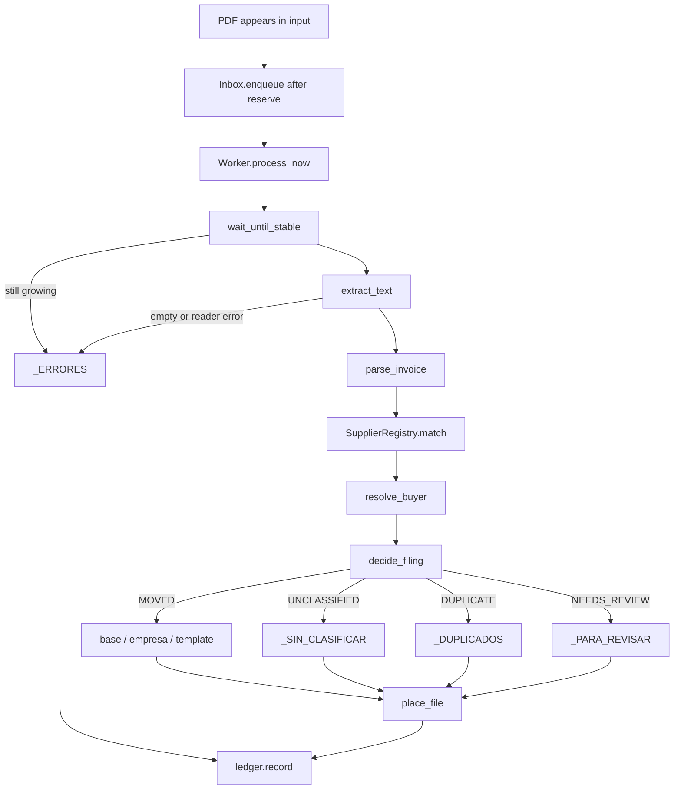

# How it works

This is the life of one PDF, from the moment it lands in the input folder to the ledger row that records where it went. The same path runs for a watcher event, a manual `process_now`, a startup sweep, a periodic rescan, and a retry of files already sitting in review or quarantine.

## Enqueue

`FolderWatcher` (watchdog) listens on `AppConfig.input_folder` for `on_created` and `on_moved`. Browsers often write a temp file and rename it to `.pdf`, so the move destination is what gets forwarded. `Inbox.enqueue` asks `SourceMemory.already_processed` (copy-mode originals that already have a signature) and then `reserve`s the absolute path in the in-flight set. A reserved path emits `EngineEventType.DETECTED` and goes onto the generation's `queue.Queue`.

`ProcessingEngine.start` also calls `process_existing`, which `list_pdfs`s the input folder and enqueues everything already there. The rescanner thread wakes every `RESCAN_INTERVAL_S` (60s) and `requeue`s whatever is still sitting in the input, covering files the observer missed. `process_now` is the synchronous cousin used by tests and by the worker itself: it reserves, processes, and always releases.

`InvoiceProcessor.process` is where the file first waits. When `wait_for_stability` is on, `file_ops.wait_until_stable` polls size every 0.4s until two consecutive reads match, or until `stability_timeout_s` expires. An unfinished download is quarantined as an incomplete file.

## Text extraction

`pdf_reader.extract_text` opens the PDF inside a `with` block so the handle is closed before any later move (an open handle on Windows raises WinError 32). It concatenates pages in layout mode first, because that keeps the column order AFIP templates use for the voucher number. When layout yields only whitespace, it retries in plain mode. A single corrupt page is skipped so the rest of the document can still be read.

`pdf_reader.read_qr_payloads` then decodes any QR in the images of the first three pages. `unique_afip_qr` keeps it only when it is an AFIP/ARCA voucher QR and all copies agree (ADR 0011).

A reader exception, or a file with no extracted text and no readable QR (a scan without a text layer), goes to `_ERRORES` via `_quarantine`. Dry-run records that failure as `ERROR` and leaves the file in place.

## Parsing

`parse_invoice(text, config.known_cuits(), qr)` decides the document kind first. With a QR it is always a factura and `merge_qr` overlays the voucher, number, issuer CUIT, date and buyer from it (the receiver CUIT, when it is one of our companies). Without one, `looks_like_order` is header-anchored: `ORDEN DE COMPRA` or `ORD COMPRA` at the start of a line, and never on a document that carries a CAE. A factura that quotes the buyer's order stays a factura.

`parse_factura` pulls the voucher from `detect_voucher` (AFIP `Cod. NN` against the table in `afip_codes.py`, then kind/letter regexes, default `FC A`), the number from `detect_number` (anchored "Punto de Venta / Comp. Nro" including `Compr.` and `;`, then the `Factura NNNN-NNNN` title for invoices only, then split layout, then a unique standalone `NNNN-NNNNNNNN` that is not preceded by `Remito`, `Asociado` or, on a note, the quoted `Factura`), the supplier from the first `Razon Social` column, the date from `Fecha de Emision`, the buyer from `detect_buyer_cuit`, and the issuer from `unique_issuer_cuit`. `parse_order` does the same job with order-specific patterns (`ORD COMPRA NRO: 2026-00004046`, `Proveedor:`, `Sociedad:`) and sets `document_type` to `ORDEN_COMPRA` so `type_label` becomes `OC`.

Missing pieces become the filler defaults: sales point `0000`, number `00000000`, supplier `PROVEEDOR_DESCONOCIDO`. Those defaults are what `has_number` and `has_supplier` later treat as incomplete.

`detect_buyer_cuit` extracts every valid CUIT on the page and intersects them with the configured society list. Zero hits leave `buyer_cuit` empty. One hit is that CUIT. Two or more set `ambiguous_buyer=True` and leave the CUIT empty, which is how an intercompany invoice reaches review.

`unique_issuer_cuit` takes the same extracted set, discards the buyer CUIT, and returns the leftover only when exactly one CUIT remains. A page whose only CUIT is not a known buyer yields no issuer: on a pre-printed form that lone CUIT is the customer's. Zero leftover, or two leftover, means `issuer_cuit` stays empty. Only values that pass the AFIP check digit count; a number embedded in a longer run (a CAE) is ignored.

## Supplier matching

After the parse, `InvoiceProcessor._canonicalize_supplier` looks a QR-verified issuer up with `SupplierRegistry.by_cuit`. Otherwise it asks the live snapshot to `match` the raw text, excluding the buyer's CUIT so a society that also appears as an issuer is ignored. `match` refuses a lone CUIT of unknown role, for the same reason as `unique_issuer_cuit`.

`match` extracts leftover CUITs the same way the parser does (valid check digit only) and subtracts `exclude_cuits`. Those leftovers are looked up in the CUIT index. Exactly one implicated supplier wins: the invoice's `supplier` becomes that row's `legal_name` and `issuer_cuit` becomes that row's CUIT, which is how two invoices that print the name differently still file into the same folder.

Anything other than a unique CUIT hit is a refusal to guess. Two registered CUITs on the page, or leftover CUITs that match nobody (or match more than one row), skip the name fallback and return `None`. The invoice keeps whatever `Razon Social` the parser already read. Name fallback runs only when the leftover set is empty: aliases of length 5 or more are scanned in the normalized text, buyers are excluded again, and 0 or 2+ hits still mean no match. A leftover unknown CUIT therefore cannot be overwritten by a coincidental alias.

When the registry returns `None` and the parser also left `UNKNOWN_SUPPLIER`, `is_reliable` later fails and the file goes to `_PARA_REVISAR`.

## Buyer matching

`resolve_buyer` runs on the parsed invoice and the configured `societies`. An `ambiguous_buyer` flag from the parser is returned as-is. An extracted `buyer_cuit` wins outright (`fuzzy=False`, score 1.0). Only when the CUIT is missing does a `buyer_name` (typical on purchase orders, from the `Sociedad:` line) go through `_fuzzy_match`.

Fuzzy comparison is `SequenceMatcher` on `normalize_name` against every `SocietyLike.match_names()` value (legal name, trade name, aliases). The best score must be at least 0.90, and the gap to the runner-up must be at least 0.05. Below the threshold the buyer stays unresolved. Inside the margin the resolution is `ambiguous`. A unique score at or above the threshold is a fuzzy candidate: the society's CUIT is attached, `fuzzy=True`, and `decide_filing` will still send the file to review. Fuzzy matching proposes a buyer for a human to confirm. It files as `NEEDS_REVIEW`, and the message includes the similarity percent.

## Filing decision

`InvoiceProcessor._decide` builds a `FilingFolders` trio and calls `decide_filing`. The archive root is `archive_base`: purchase orders under `orders_base_for(buyer.cuit)`, invoices under `folder_for_cuit(buyer.cuit)`. Review and duplicates are always `base/_PARA_REVISAR` and `base/_DUPLICADOS`.

`decide_filing` inspects, in this order:

| Condition | Outcome | Destination |
|---|---|---|
| `buyer.ambiguous` | `NEEDS_REVIEW` | `_PARA_REVISAR` |
| `is_reliable` is false (missing number, unknown supplier, or issuer name equals or contains one of your own societies, ignoring punctuation; containment only for names of 8+ characters) | `NEEDS_REVIEW` | `_PARA_REVISAR` |
| `is_duplicate` | `DUPLICATE` | `_DUPLICADOS` |
| `buyer.fuzzy` | `NEEDS_REVIEW` | `_PARA_REVISAR` |
| `buyer.cuit` is set | `MOVED` | company folder, then `destination_template` |
| buyer still unresolved | `UNCLASSIFIED` | `_SIN_CLASIFICAR` (orders: `_SIN_SOCIEDAD`) |

Leftover CUITs that blocked the name fallback show up here as an incomplete supplier when the parser also failed to read a `Razon Social`. A fuzzy buyer is checked after reliability and after the duplicate gate, so a second copy of an already-filed fuzzy match still lands in `_DUPLICADOS`.

Unreadable PDFs, timed-out downloads, reader exceptions and failed placements bypass `decide_filing` and go to `_ERRORES` as `QUARANTINED`.

The destination directory is `destination_dir(invoice, decision.base_folder, config.destination_template)`. The default template is `{supplier}`. Tokens are `supplier`, `society`, `year`, `month`, `day` (missing dates become `sin_fecha`). Unknown tokens expand to empty and drop out. The file name is `build_filename`: `{supplier} {type_label} {full_number}.pdf`.

## Duplicate identity

A document is identified two ways. `ParsedInvoice.identity` is `{normalize_name(supplier)}|{full_number}|{type_label}` and exists only when both number and supplier are present. `ParsedInvoice.issuer_identity` is `{issuer_cuit}|{full_number}|{type_label}` and exists only when both number and issuer CUIT are present. The second key is what still matches after a registry re-import renames the supplier.

`Ledger.archived_destination` looks up either key, restricted to `FILED_OUTCOMES` (`MOVED`, `UNCLASSIFIED`), `reverted = 0`, and a non-null destination. Only those two outcomes count as already filed. `is_archived_duplicate` then checks that the previously archived file still exists on disk. A deleted original is filed again rather than treated as a phantom duplicate.

## Placement

`place_file` calls `file_ops.copy_file` or `file_ops.move_file`. Both create the target directory, treat an already-at-destination `samefile` as a no-op, and otherwise pick `unique_destination`, which appends ` (n)` starting at 2 until the name is free. The transfer itself is `shutil.copy2` or `shutil.move` (the latter works across drives). On Windows the path is prefixed with `\\?\`, or `\\?\UNC\` for a network share, so deeply nested supplier folders stay under the OS limit.

Copy mode (`AppConfig.copy_files`) leaves the original in the input folder. When the source already sits under `review_folder` or `quarantine_folder`, `_copy_inbox_only` forces a move anyway, so "retry pending" actually clears those trees.

A failed placement is retried as a quarantine into `_ERRORES`. A failed quarantine leaves the file in the input folder as `ERROR` so the next rescan can try again.

## Ledger

Every result except `SKIPPED_MISSING` (the path vanished before processing) is written by `Worker.record_result` -> `Ledger.record`. The row stores timestamp, source name, `identity`, supplier, voucher label, outcome, destination, message, `issuer_cuit`, `issuer_identity` and `source_signature`. Schema v3 is what added the last two columns, plus indexes on both. The same database also holds `processed_sources` (copy-mode signatures) and `suppliers` (the Excel-imported registry).

## Copy mode

With `copy_files` on, the original stays in the input folder and a copy is placed at the destination. `SourceMemory.remember` then records `{abspath}|{size}|{int(mtime)}` from `file_ops.file_signature` both in the in-memory set and, for placed outcomes, in `processed_sources` via `mark_source_seen`. The next watch, rescan or startup sweep sees that signature in `already_processed` and skips the original.

`Ledger.source_seen` requires more than a stored signature: the matching `records` row must still have a destination that exists on disk. A vanished destination makes the original eligible again. Rows with no `source_signature` fall back to the `processed_sources` table.

Undo of a copy-mode row calls `mark_reverted`, which deletes that signature from `processed_sources`. The original in the input folder can then be processed again.

## Dry-run

`AppConfig.dry_run` short-circuits `_archive` before `place_file`. The result is `DRY_RUN` with `intended` set to whatever `decide_filing` chose, `destination` set to the path that would have been used, and the source left untouched. Session stats count `intended` through `ProcessResult.counted_outcome`. A dry-run of an unreadable PDF is recorded as `ERROR` rather than a simulated quarantine. `SourceMemory` still remembers the signature for the current generation so the same file is not re-simulated on every rescan.

## Retry pending

The History view's retry action goes through `HistoryActions.reprocess_pending`. If the monitor is already running it calls `ProcessingEngine.reprocess_pending` directly. Otherwise it saves the current settings and asks `EngineBridge.start`, then kicks the retry once `STARTED` arrives.

`Inbox.reprocess_pending` walks `review_folder` and `quarantine_folder` with `list_pdfs(..., recursive=True)` and `requeue`s each PDF. Because those sources sit under review or quarantine, placement uses a move even when copy mode is on. After a company is added or a supplier is imported, this is how files waiting for a human go through the pipeline again.

## Undo

Undo is available while the monitor is stopped. `Ledger.last_undoable` returns the newest row whose outcome is in `UNDOABLE_OUTCOMES` (`MOVED`, `UNCLASSIFIED`, `DUPLICATE`, `NEEDS_REVIEW`, `QUARANTINED`), that still has a destination, and that is not already reverted.

`perform_undo` moves that destination back to `input_folder` (again through `unique_destination`, so a name clash in the inbox gets ` (n)`), then `mark_reverted`. If the mark fails, `_restore` moves the file back to the original destination so the ledger and the disk stay aligned. If the destination file is already gone, the row is marked reverted and reported as `MISSING`. `mark_reverted` also forgets the copy-mode source signature, which is what lets the original be processed again.
